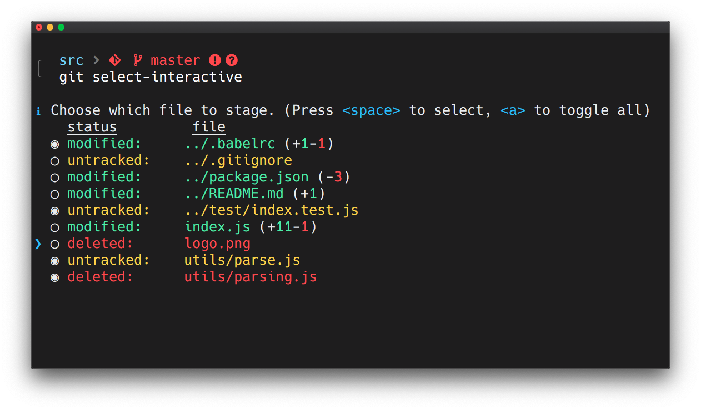
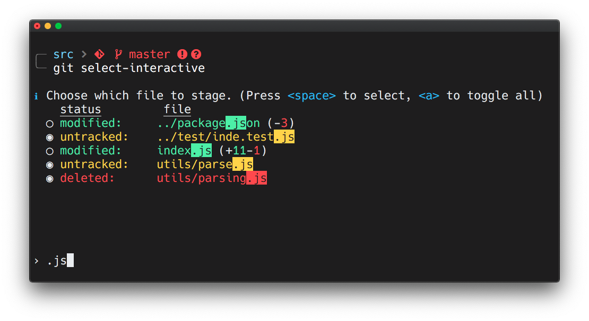

# git-select-interactive

> Interactive mode for git add




## Prerequisites

Requires [git](https://git-scm.com/downloads) and [node.js](https://nodejs.org) to be installed.

## Install

```
$ npm install --global git-select-interactive
```

## Usage

Run with:

```bash
$ git select-interactive
```

Navigate file list with arrows, press `<space>` to select/deselect a single file, press `<a>` to select/deselect all. Finally press `<return>` to **stage** files.

Use `--reset` option to **unstage** files, `--stash` to **stash** files.

### Search bar

Press `<f>` to display the search bar and then type file name:

<p align="center">
  
</p>

To go back to selection mode press `<return>`. Press `<space>` to select/deselect a single file or press `<a>` to select/deselect the filtered file list. Then press `<return>` to reset the search query or press `<f>` to modify it.

## License

MIT @ [Ivan Rossi](https://github.com/ivanross)
